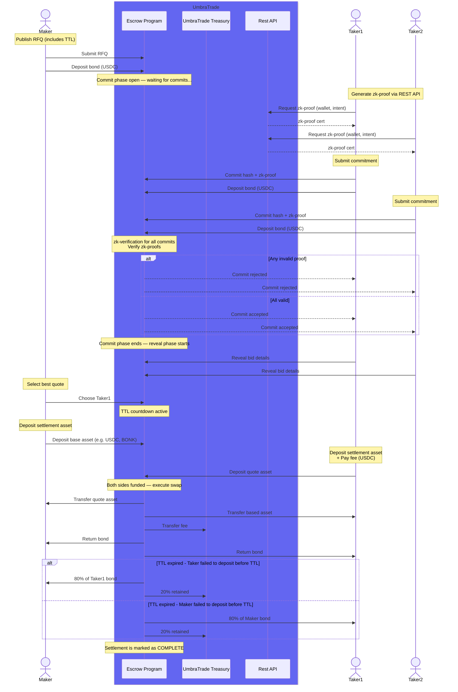

# 🧩 UnleakTrade Settlement Engine

**UnleakTrade Settlement Engine** is the core **on-chain Solana program** that coordinates OTC (Over-The-Counter) trading flows between makers and takers.  
It enforces trustless settlement, manages bonds, and encodes the entire **RFQ lifecycle** into verifiable, stateful Solana accounts.

> ⚠️ **Disclaimer**  
> This repository is under **active and fast-paced development**.  
> While every effort is made to keep this documentation accurate, the implementation may evolve faster than the README.  
> Always refer to the latest program source and tests for the most up-to-date details.

---

## ⚙️ Architecture

### 🧱 Modules

- **Config Account**
  - Holds global settings (admin authority, USDC mint, treasury address).
  - PDA: `["config"]`
- **RFQ Account**
  - One per OTC quote request, uniquely identified by `(maker, uuid)`.
  - PDA: `["rfq", maker, uuid]`
  - References a **bond vault** (USDC ATA) owned by the RFQ PDA.

---

## 🔄 RFQ Lifecycle

Each RFQ passes through the following **states**, driven by user actions and TTL expirations:

| Phase | Description | State |
|-------|--------------|-------|
| Init | Maker creates a draft RFQ (bond amount, TTLs, base/quote tokens) | `Draft` |
| Publish | Maker opens RFQ to takers | `Open` |
| Commit | Takers commit hashed quotes | `Committed` |
| Reveal | Takers reveal quotes for validation | `Revealed` |
| Select | Maker selects the winning quote | `Selected` |
| Fund | Maker & taker deposit base/quote tokens | `Funded` |
| Settle | Settlement executed atomically | `Settled` |
| Timeout | RFQ exceeds TTL without completion | `Expired` / `Aborted` / `Ignored` |

Each TTL (`commit_ttl`, `reveal_ttl`, `selection_ttl`, `fund_ttl`) enforces a time window.  
If one side fails to act, the program automatically allows third-party “cleaners” or the admin to close the RFQ and **distribute bonds** per protocol rules.

---

## ↔️ Sequence Diagram

---

## 💰 Bonding Mechanism

Every participant posts a **USDC bond** that ensures fair play:

- Non-funding or non-revealing actors lose their bond.
- The opposing compliant party receives 80% of the slashed bond.
- The remaining 20% flows to the **UnleakTrade Treasury** (admin-controlled).
- If both fail, the treasury receives 100%.

Bonds are stored in **RFQ-owned USDC ATAs**, created automatically at initialization.

---

## 🔗 Integration with Liquidity Guard

The **Liquidity Guard microservice** acts as an off-chain validator:

- Generates **signed RFQ attestations** for makers and takers.
- Verifies **liquidity and solvency** of each participant before commitment.
- Pushes validated actions to the Settlement Engine for finalization.

Together, Liquidity Guard + Settlement Engine form a **hybrid trust-minimized OTC system** —  
off-chain intelligence, on-chain enforcement.

---

## 🧠 Program Design Highlights

- **Anchor 0.32.1** framework
- **UUID-based RFQ PDAs** (multi-RFQ support per maker)
- **Strict state machine** enforced via enum transitions
- **No CPIs between internal handlers** — all state updates are direct
- **Cleaner incentives** for expired/aborted RFQs
- **On-chain bond accounting** via SPL Token + ATA programs

---

## 🧰 Getting Started

```bash
# Build the program
anchor build

# Run tests
anchor test
```
