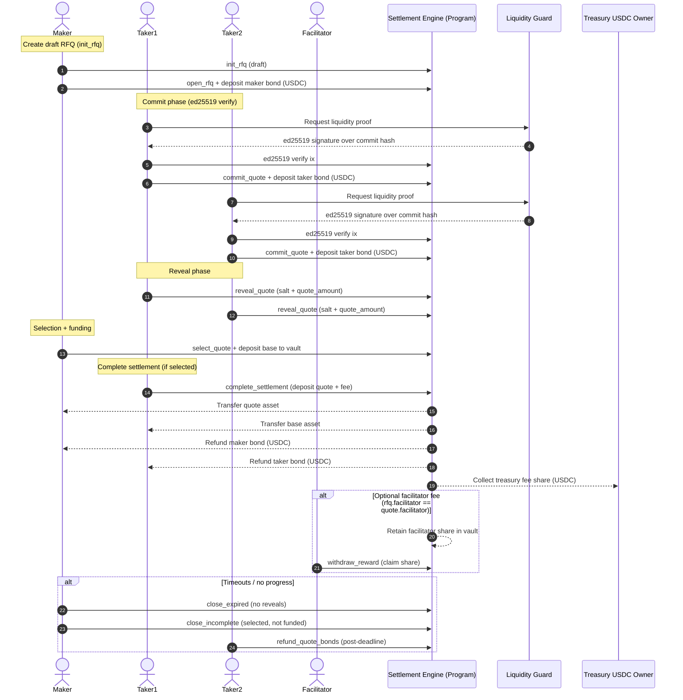

# 🧩 UnleakTrade Settlement Engine

**UnleakTrade Settlement Engine** is the core **on-chain Solana program** for OTC (Over-The-Counter) RFQ trading between makers and takers.  
It enforces trustless settlement, manages bonds and fees in USDC, and encodes the entire **RFQ lifecycle** into verifiable, stateful Solana accounts.

---

## ⚙️ Architecture

### 🧱 Accounts & PDAs

- **Config**
  - Global singleton: admin, USDC mint, treasury owner, liquidity guard pubkey (ed25519), facilitator fee bps.
  - PDA: `["config"]`
- **RFQ**
  - One per OTC request, uniquely identified by `(maker, uuid)`.
  - PDA: `["rfq", maker, uuid]`
  - Holds assets, economics, TTLs, state, and references to vaults/accounts.
- **Quote**
  - One per `(rfq, taker)` for commit/reveal lifecycle.
  - PDA: `["quote", rfq, taker]`
- **CommitGuard**
  - Prevents commit hash reuse globally.
  - PDA: `["commit-guard", commit_hash]`
- **Settlement**
  - Immutable snapshot after selection (amounts, mints, vaults, participants).
  - PDA: `["settlement", rfq]`
- **SlashedBondsTracker**
  - Tracks bond seizures into treasury for a given RFQ.
  - PDA: `["slashed_bonds_tracker", rfq]`
- **FeesTracker**
  - Records taker fee paid to treasury.
  - PDA: `["fees_tracker", rfq]`
- **FacilitatorRewardTracker**
  - Records facilitator fee claim (when applicable).
  - PDA: `["facilitator_reward", rfq, facilitator]`

---

## 🔄 RFQ Lifecycle

Each RFQ passes through the following **states**, driven by user actions and TTL expirations (all TTLs are relative to `opened_at`):

| Phase | Description | State |
|-------|--------------|-------|
| Init | Maker creates a draft RFQ (bond amount, TTLs, base/quote tokens) | `Draft` |
| Publish | Maker opens RFQ to takers | `Open` |
| Commit | Takers commit hashed quotes | `Committed` |
| Reveal | Takers reveal quotes for validation | `Revealed` |
| Select | Maker selects the winning quote and deposits base | `Selected` |
| Settle | Taker deposits quote + fee; swap and refunds execute | `Settled` |
| Timeout | RFQ exceeds TTL without completion | `Expired` / `Ignored` / `Incomplete` |

Funding deadline behavior:
- If a quote is selected: funding deadline = `selected_at + fund_ttl_secs`.
- If no selection yet: funding deadline = `opened_at + commit + reveal + selection + fund`.

---

## 🔐 Liquidity Guard Commit/Reveal

Commit phase requires a Liquidity Guard **ed25519 signature** on the 32-byte commit hash.  
The on-chain program verifies that the immediately preceding instruction is an ed25519 verify ix signed by the configured Liquidity Guard public key.

The commit hash is recomputed on reveal as:

```
hash(
  salt (64 bytes) ||
  rfq_pubkey ||
  taker_pubkey ||
  quote_mint ||
  quote_amount (u64 LE) ||
  bond_amount (u64 LE) ||
  fee_amount (u64 LE)
)
```

Reveals must meet `min_quote_amount` and match the stored commit hash.

---

## ↔️ Sequence Diagram (Current Flow)



## 💰 Bonds, Fees, and Slashing

- Maker and each taker post a **USDC bond** into the RFQ-owned `bonds_fees_vault`.
- On successful settlement, both bonds are refunded to their owners.
- Slashed bonds (for invalid or missing reveals, or incomplete settlement) are sent **entirely to the treasury**.
- Takers pay a fixed **USDC fee** on settlement:
  - Treasury receives the fee minus any facilitator share.
  - If `rfq.facilitator` matches `quote.facilitator`, the facilitator share is retained in the vault and can be claimed via `withdraw_reward`.

---

## 🔗 Liquidity Guard Integration

The **Liquidity Guard** acts as an off-chain validator:

- Verifies **liquidity and solvency** of takers before commit.
- Produces an ed25519 signature over the commit hash.
- The program enforces that signature using the native ed25519 verify instruction.

Together, Liquidity Guard + Settlement Engine form a **hybrid trust-minimized OTC system**:  
off-chain verification with on-chain enforcement.

---

## 🧠 Program Design Highlights

- **Anchor framework** (see `Cargo.toml`)
- **UUID-based RFQ PDAs** (multi-RFQ support per maker)
- **Strict state machine** enforced via enum transitions
- **Commit-reveal** with Liquidity Guard ed25519 verification
- **On-chain bond and fee accounting** via SPL Token + ATA programs
- **Facilitator fee support** with on-chain reward claims

---

## 🧰 Getting Started

```bash
# Build the program
anchor build

# Run tests
anchor test
```
