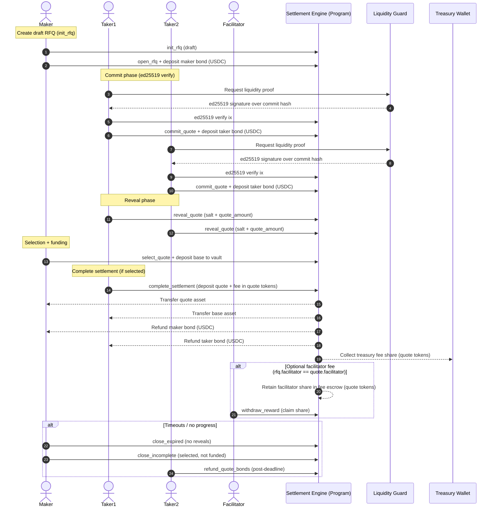

# 🧩 UnleakTrade Settlement Engine

**UnleakTrade Settlement Engine** is the core **on-chain Solana program** for OTC (Over-The-Counter) RFQ trading between makers and takers.  
It enforces trustless settlement, manages USDC bonds and quote-token fees, and encodes the entire **RFQ lifecycle** into verifiable, stateful Solana accounts.

---

## ⚙️ Architecture

### 🧱 Accounts & PDAs

- **Config**
  - Global singleton: admin, USDC mint, treasury wallet, liquidity guard pubkey (ed25519), facilitator fee bps.
  - PDA: `["config"]`
- **RFQ**
  - One per OTC request, uniquely identified by `(maker, uuid)`.
  - PDA: `["rfq", maker, uuid]`
  - Holds assets, economics, TTLs, state, and references to vaults/accounts.
- **Quote**
  - One per `(rfq, taker)` for commit/reveal lifecycle.
  - PDA: `["quote", rfq, taker]`
- **CommitGuard**
  - Prevents commit hash reuse globally.
  - PDA: `["commit-guard", commit_hash]`
- **Settlement**
  - Immutable snapshot after selection (amounts, mints, vaults, participants).
  - PDA: `["settlement", rfq]`
- **SlashedBondsTracker**
  - Tracks bond seizures into treasury for a given RFQ.
  - PDA: `["slashed_bonds_tracker", rfq]`
- **FeesTracker**
  - Records taker fee paid to treasury (in quote tokens).
  - PDA: `["fees_tracker", rfq]`
- **FacilitatorRewardTracker**
  - Records facilitator fee claim (when applicable).
  - PDA: `["facilitator_reward", rfq, facilitator]`

---

## 🛠️ Managing Config

`Config` is the **single most important account** in the deployment — it is the
global singleton (PDA `["config"]`) that every other instruction reads. There is
exactly one per program deployment, owned by `admin`.

| Field | Type | Meaning |
|-------|------|---------|
| `admin` | `Pubkey` | Admin authority — the only signer allowed to update/close Config |
| `usdcMint` | `Pubkey` | USDC mint used for fees/bonds |
| `treasuryWallet` | `Pubkey` | Treasury wallet that collects fees |
| `liquidityGuard` | `Pubkey` | ed25519 public key of the liquidity-guard service |
| `facilitatorFeeBps` | `u16` | Facilitator fee in basis points (1 BPS = 0.01%), **0..10000** |

There are three scripts, all cluster-agnostic. The target cluster comes from
`ANCHOR_PROVIDER_URL` — a full RPC URL **or** a short alias (`devnet`, `testnet`,
`mainnet`, `localnet`) — and **defaults to devnet** when unset:

### 1. Initialise (once per cluster) — `scripts/init-config-devnet.ts`

Creates the Config account. Idempotent (exits if it already exists). Inputs via
env vars; the `ANCHOR_WALLET` keypair becomes `Config.admin`:

```bash
ANCHOR_PROVIDER_URL=https://api.devnet.solana.com \
ANCHOR_WALLET=~/.config/solana/id.json \
LIQUIDITY_GUARD=<ed25519 service pubkey> \
USDC_MINT=4zMMC9srt5Ri5X14GAgXhaHii3GnPAEERYPJgZJDncDU \
TREASURY_WALLET=<pubkey> \
FACILITATOR_FEE_BPS=1000 \
yarn init-config
```

### 2. Update any field(s) — `scripts/update-config.ts`

Drives the on-chain `update_config` instruction, which updates **any subset** of
fields in one transaction; fields you don't pass are left untouched. Values come
from a **JSON or YAML file**, **CLI flags**, or both (**flags override the file**).

> ⚠️ The signing wallet (`ANCHOR_WALLET`) **must be the current `Config.admin`**,
> otherwise the transaction fails with `Unauthorized`.

**a) CLI flags only**

```bash
ANCHOR_PROVIDER_URL=https://api.devnet.solana.com \
ANCHOR_WALLET=~/.config/solana/id.json \
yarn update-config --facilitator-fee-bps 1500
```

**b) From a JSON / YAML file** (parsed by extension; both camelCase and
snake_case keys accepted). Copy `scripts/config.example.yaml` (or `.json`) and
edit only the fields you want to change:

```bash
yarn update-config --config scripts/config.example.yaml
```

```yaml
# scripts/config.example.yaml — every key is optional
facilitatorFeeBps: 1500
# treasuryWallet: "TreasuryPubkeyBase58Here..."
# liquidityGuard: "5gfPFweV3zJovznZqBra3rv5tWJ5EHVzQY1PqvNA4HGg"
```

**c) File for the base, flags to override individual fields**

```bash
yarn update-config --config scripts/config.example.yaml --treasury-wallet <pubkey>
```

**Available flags**

```
--config <path>            JSON (.json) or YAML (.yaml/.yml) file of fields
--admin <pubkey>           rotate admin authority (ONE-WAY handoff!)
--usdc-mint <pubkey>
--treasury-wallet <pubkey>
--liquidity-guard <pubkey>
--facilitator-fee-bps <n>  integer 0..10000
--dry-run                  print the planned before → after diff, send no tx
--help                     show usage
```

The script prints a **before → after diff**, skips values that already match
on-chain (so the tx never carries no-op writes), warns loudly on **admin
rotation**, and supports `--dry-run` to preview changes safely:

```bash
yarn update-config --config scripts/config.example.yaml --dry-run
```

### 3. View the current Config — `scripts/get-config.ts`

Read-only: fetches and displays the Config account. No `ANCHOR_WALLET` needed (no
transaction is sent — an ephemeral wallet is used), and the cluster defaults to
devnet.

```bash
# Human-readable summary (PDA, cluster, fields, fee as %) — defaults to devnet
yarn get-config

# Target another cluster (alias or full URL)
ANCHOR_PROVIDER_URL=localnet yarn get-config

# Machine-readable JSON only (pipeable); prints `null` if not initialised
yarn get-config --json
```

---

## 🔄 RFQ Lifecycle

Each RFQ passes through the following **states**, driven by user actions and TTL expirations (all TTLs are relative to `opened_at`):

| Phase | Description | State |
|-------|--------------|-------|
| Init | Maker creates a draft RFQ (bond amount, TTLs, base/quote tokens) | `Draft` |
| Publish | Maker opens RFQ to takers | `Open` |
| Commit | Takers commit hashed quotes | `Committed` |
| Reveal | Takers reveal quotes for validation | `Revealed` |
| Select | Maker selects the winning quote and deposits base | `Selected` |
| Settle | Taker deposits quote + fee; swap and refunds execute | `Settled` |
| Timeout | RFQ exceeds TTL without completion | `Expired` / `Ignored` / `Incomplete` |

Funding deadline behavior:
- If a quote is selected: funding deadline = `selected_at + fund_ttl_secs`.
- If no selection yet: funding deadline = `opened_at + commit + reveal + selection + fund`.

---

## 🔐 Liquidity Guard Commit/Reveal

Commit phase requires a Liquidity Guard **ed25519 signature** on the 32-byte commit hash.  
The on-chain program verifies that the immediately preceding instruction is an ed25519 verify ix signed by the configured Liquidity Guard public key.

The commit hash is recomputed on reveal as:

```
hash(
  salt (64 bytes) ||
  rfq_pubkey ||
  taker_pubkey ||
  quote_mint ||
  quote_amount (u64 LE) ||
  bond_amount (u64 LE) ||
  taker_fee_bps (u16 LE)
)
```

Reveals must meet `min_quote_amount` and match the stored commit hash.

---

## ↔️ Sequence Diagram (Current Flow)


```mermaid
sequenceDiagram
    autonumber
    actor Maker
    actor Taker1
    actor Taker2
    actor Facilitator
    participant SE as Settlement Engine (Program)
    participant LG as Liquidity Guard
    participant Treas as Treasury Wallet

    Note over Maker: Create draft RFQ (init_rfq)
    Maker->>SE: init_rfq (draft)
    Maker->>SE: open_rfq + deposit maker bond (USDC)

    Note over Taker1,Taker2: Commit phase (ed25519 verify)
    Taker1->>LG: Request liquidity proof
    LG-->>Taker1: ed25519 signature over commit hash
    Taker1->>SE: ed25519 verify ix
    Taker1->>SE: commit_quote + deposit taker bond (USDC)

    Taker2->>LG: Request liquidity proof
    LG-->>Taker2: ed25519 signature over commit hash
    Taker2->>SE: ed25519 verify ix
    Taker2->>SE: commit_quote + deposit taker bond (USDC)

    Note over Taker1,Taker2: Reveal phase
    Taker1->>SE: reveal_quote (salt + quote_amount)
    Taker2->>SE: reveal_quote (salt + quote_amount)

    Note over Maker: Selection + funding
    Maker->>SE: select_quote + deposit base to vault

    Note over Taker1: Complete settlement (if selected)
    Taker1->>SE: complete_settlement (deposit quote + fee in quote tokens)
    SE-->>Maker: Transfer quote asset
    SE-->>Taker1: Transfer base asset
    SE-->>Maker: Refund maker bond (USDC)
    SE-->>Taker1: Refund taker bond (USDC)
    SE-->>Treas: Collect treasury fee share (quote tokens)

    alt Optional facilitator fee (rfq.facilitator == quote.facilitator)
        SE-->>SE: Retain facilitator share in fee escrow (quote tokens)
        Facilitator->>SE: withdraw_reward (claim share)
    end

    alt Timeouts / no progress
        Maker->>SE: close_expired (no reveals)
        Maker->>SE: close_incomplete (selected, not funded)
        Taker2->>SE: refund_quote_bonds (post-deadline)
    end
```

## 💰 Bonds, Fees, and Slashing

### Bonds (USDC)
- Maker and each taker post a **USDC bond** into the RFQ-owned `bonds_escrow`.
- On successful settlement, both bonds are refunded to their owners.
- Slashed bonds (for invalid or missing reveals, or incomplete settlement) are sent **entirely to the treasury** in USDC.

### Fees (Quote tokens)
- Takers pay a protocol fee **in quote tokens** on settlement.
- Fee formula: `floor(quote_amount * taker_fee_bps / 10_000)`, with a minimum of **1** when `taker_fee_bps > 0` (the protocol is never free).
- Treasury receives the fee minus any facilitator share.
- If `rfq.facilitator` matches `quote.facilitator`, the facilitator share (`floor(total_fee * facilitator_fee_bps / 10_000)`) is retained in a quote-token fee escrow and can be claimed via `withdraw_reward`.
- The fee formula must match the **liquidity-guard** implementation exactly to prevent preflight/on-chain mismatches.

---

## 🔗 Liquidity Guard Integration

The **Liquidity Guard** acts as an off-chain validator:

- Verifies **liquidity and solvency** of takers before commit.
- Produces an ed25519 signature over the commit hash.
- The program enforces that signature using the native ed25519 verify instruction.

Together, Liquidity Guard + Settlement Engine form a **hybrid trust-minimized OTC system**:  
off-chain verification with on-chain enforcement.

---

## 🧠 Program Design Highlights

- **Anchor framework** (see `Cargo.toml`)
- **UUID-based RFQ PDAs** (multi-RFQ support per maker)
- **Strict state machine** enforced via enum transitions
- **Commit-reveal** with Liquidity Guard ed25519 verification
- **On-chain bond and fee accounting** via SPL Token + ATA programs
- **Facilitator fee support** with on-chain reward claims

---

## 🧰 Getting Started

```bash
# Build the program
anchor build

# Run tests
anchor test
```
